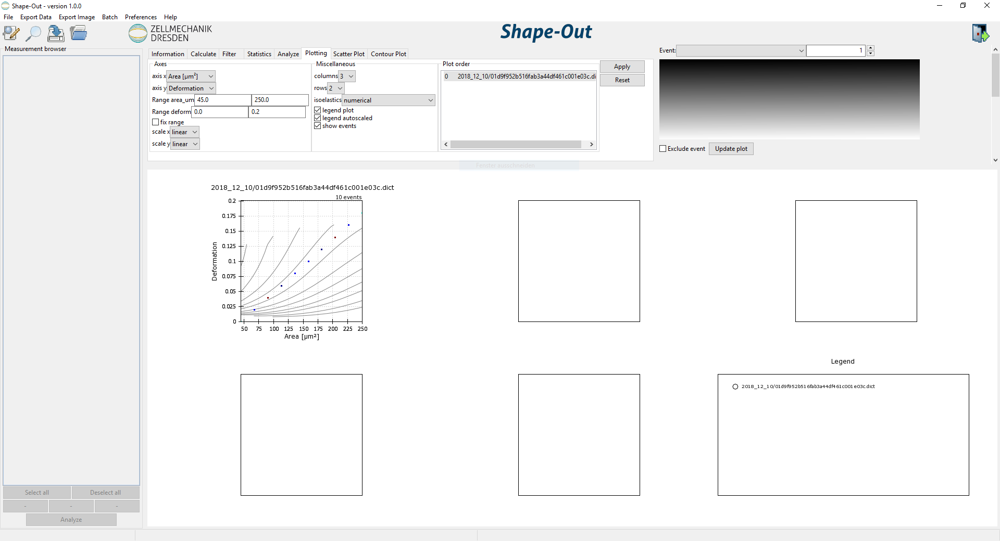
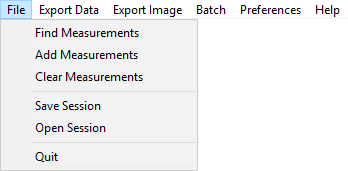
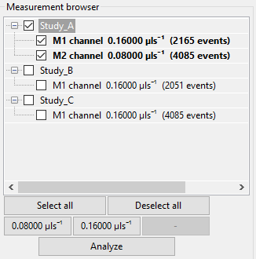
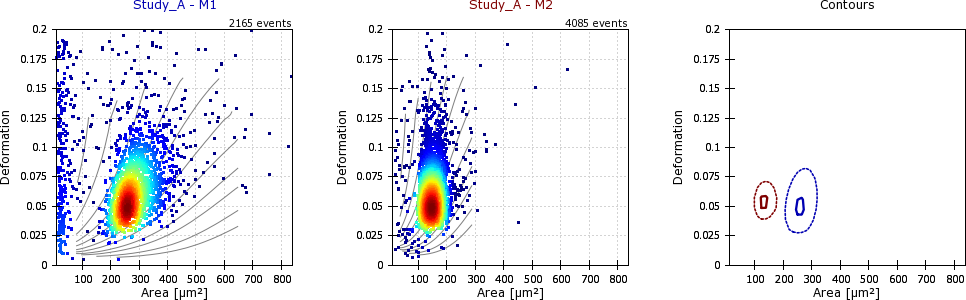
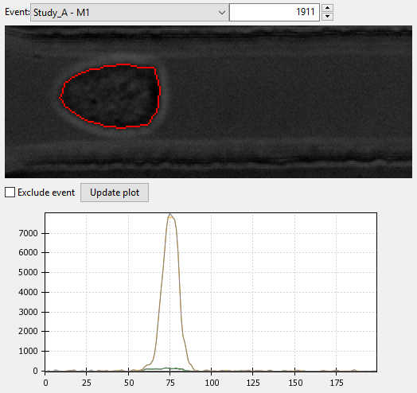
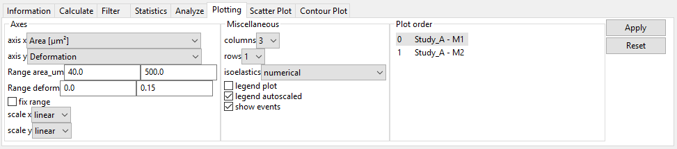

==============
User Interface
==============

Basic usage
===========
On start-up, you are presented with an empty interface. To load data,
use *File* → *Find Measurements* and select a directory containing experimental
data. The directory is searched recursively for .tdms and .rtdc files which
are then displayed in the measurement browser on the left. Here, you can select
the measurements and plot them by clicking *Analyze* at the bottom of the
measurement browser. The configuration tabs at the top allow you to filter the data
and change the visualization in the plot area. Individual events in the plot
area can be selected and are then displayed in the event area (top right).
It is possible to adjust the sizes of measurement browser, configuration tabs,
event area, and plotting area by dragging the borders in-between those elements.
The *File* menu allows you to save sessions.
To export data and plots, use the *Export Data/Image* menus.  

    Shape-Out user interface on start-up. The measurement browser on the
    left is empty. The configuration tabs on the top show the plotting
    settings. A dummy measurement is shown in the plotting area.  

Menu Bar
========

**File Menu**

Find Measurements:
  Load experimental data into the measurement browser.
  The selected directory is searched recursively for .tdms and .rtdc files.

Add Measurement:
  Add experimental data to the measurement browser
  without replacing those currently shown.

Clear Measurements:
  Remove all measurements, which are
  not selected in the measurement browser.

Save session:
  Save the status of the current analysis.

Load session:
  Load a saved session.

Quit:
  Exit Shape-Out.

**Export Data**

All event data (\*.fcs):
  Export datasets as flow cytometry standard files
  (scalar features only).

All event data (\*.tsv):
  Export datasets as tab-separated values
  (scalar features only).

All event data (\*.rtdc):
  Export datasets as .rtdc files.
  (:ref:`expert mode <ui_expert>` only).

Computed statistics (\*.tsv):
  Export the dataset statistics as
  tab-separated values. 

All event images (\*.avi):
  Export the event images as a video file.

**Export Image**

Graphical plot (\*.pdf):
  Export the plot area as a .pdf file.

Event image with contour (\*.png):
  Export the current event image
  including the contour.

Event image without contour (\*.png):
  Export the current event image
  without contour.

**Batch**

Statistical analysis:
  Perform a statistical analysis
  (see *Export Data → Computed statistics (\*.tsv)* for multiple
  measurements stored on disk.

**Preferences**

Autosave session:
  Automatically save the current session every five
  seconds. When Shape-Out unexpectedly quits, the user is asked on start-up
  whether to load the autosaved session.

Check for updates:
  Automatically check for a new release and notify
  the user via the menu bar when a new release is available.

Expert mode:
  Unlock experimental features.
  (see :ref:`expert mode <ui_expert>`).

Measurement browser
===================

The measurement browser shows the measurements that are available for
plotting. They are sorted according to the directory tree structure.
For each measurement, the measurement index, the measurement region, the
flow rate, and the number of events are shown.
The buttons at the bottom of the measurement browser allow to change
the selection (all, none, only specific flow rates).

The Analyze button loads the experimental data which is then visualized
in the plot area.
When a measurement is part of the current analysis, it is shown with a
bold font weight in the measurement browser.

Plot Area
=========

The plot area visualizes the current analysis. It is configured via the
configuration tabs *Plotting*, *Scatter Plot*, and *Contour Plot* (see below). 

The axes limits can directly be modified with the mouse by dragging the plot
with the left mouse button (axes offset), zooming in or out with the
mouse wheel, or by drawing a rectangle using the right mouse button (zoom
to selection). 

In addition, an individual event can be selected in a scatter plot,
which is then displayed in the event area (top right).

Event Area
==========

The event area shows information about individual events. At the top, the
measurement and the event index can be selected. The event image with
the event contour (red) is shown. With the checkbox, individual
events can be excluded from an analysis.

The plot below (not visible initially - drag the border between event area
and plot area or scroll down to make it visible) shows the fluorescence
signal over time. This plot is only available for RT-fDC data.

Configuration Tabs
==================

The configuration tabs allow to view and edit multiple aspects of the
current analysis and facilitate additional analysis steps.

Information
-----------
All properties of the current analysis are shown. If properties differ
between measurements within an analysis, the corresponding values are
set to *(multiple)*. To see the full panel, use the scroll bars or
increase the size of the panel by dragging the edge.

A summary of all valid metadata properties can be found in the
:ref:`dclab documentation <dclab:sec_experiment_meta>`. The most important
properties are:

event count:
  Number of recorded cells. In Shape-In this number is shown on the front
  panel as *Number of cells measured*.

channel width:
  Dimension of the channel. This number is not detected automatically
  by Shape-In, but has to be set by hand in the front panel
  under *Channel dimension [µm]*.

chip region:
  The position of the region of interest during the measurement.
  This is not detected automatically by Shape-In, but has to be set
  by hand in the front panel under *Region of interest in the …*.

flow rate:
  The sum of sheath and sample flow in µl/s. Shape-In records this
  number when the measurement starts and shows it on the front panel
  under *Flow Rate [µl/s]*.

frame rate:
  Camera frame rate during the measurement. Shape-In records this information
  when the measurement starts and shows it in the expert tab under
  *Camera tools* and *Framerate [Hz]*.

pixel size:
  Resolution of the microscope-camera-system in [µm/pixels]. In Shape-In
  this number is shown in the expert tab settings under *Resolution [µm/pix]*.

run index:
  The number of the measurement within the opened project. In Shape-In
  this number is shown on the front panel under *current/next #*.

Calculate
---------
This tab allows to compute additional features for the analysis.

Elastic modulus:
  Compute the elastic modulus according to :cite:`Mokbel2017`. The new
  feature *Young’s Modulus [kPa]* (``emodulus``) will be available for
  plotting and analysis.

Fluorescence maximum crosstalk correction:
  Perform a crosstalk correction for multi-color RT-fDC measurements.
  New features *FL-1 maximum, crosstalk-corrected [a.u.]* (``fl1_max_ctc``)
  will be available for plotting and analysis.

Filter
------
In this tab, you can filter your data by excluding values beyond certain
limits. Select the *enable filters* check box on the right and hit the
Apply/Reset button to apply/reset the settings. The *Box Filters* limit
the range of parameters; the *Polygon Filters* allow freely defining a
gate by a polygon in the current plot. The filters are applied to all
measurements of the analysis, independent of the plot shown currently.

**Box Filters**:
Box filters allow to set minium and maximum values for each feature
(e.g. Area [µm]) of a measurement.
Minimum and maximum values for box filters are set to 0.0 by default.
As long as they are equal, the filter is not applied.
On the left of the table the minimum value is set, on the right the
maximum. For a list containing short descriptions of all features,
please see the :ref:`dclab documentation <dclab:sec_features>`.
The most important box feature filters are:

Range area_ratio:
  Limit the porosity, the relative difference between convex hull area and cell area.
  A value of "1", means that the convex hull and is equal to event contour.
  Values smaller than "1" are not possible, because the convex hull cannot
  be smaller than the contour.

Range area_um:
  Limit the cell area in [µm²].

Range aspect:
  Limits the aspect ratio of the bounding box, the ratio of height and
  length of the bounding box around the contour of the event.

Range deform:
  Limits the deformation.

Range post x:
   Limit the position along channel axis [µm].

Range post y:
   Limit the position lateral in channel [µm].

Range time:
  Limits the event time [s].

Range x-size:
  Limit the bounding box size along the channel axis [µm].

Range x-size:
  Limit the bounding box size perpendicular to the channel axis [µm].

**Polygon Filters**:
Polygon filters are two-dimensional filters that can be used to specify
non-rectangular regions of interest. To create a polygon filter, select
the desired measurement (used as a plot template) in the dropdown menu
and click *New*. A new window pops up. Clicking on the plot will generate
the points of the polygon filter. When you are done, press ``Enter`` on
the keyboard and close the window. The new polygon filter is then shown in the
list. Polygon filters can be applied to all measurements or only to individual
measurements. You can see which polygon filters are set for which measurement
by selecting each measurement in the dropdown list. In addition, polygon
filters can be duplicated, inverted, exported and imported.

**Filter Hierarchy**:
Filter hierarchies allow to create a virtual measurement from an existing
measurement. All events that are filtered in the original measurement
will not show up in its hierarchy child, allowing to perform additional
filter operations on hierarchy children.
This comes in handy e.g. when different subpopulations in a study
need to be distinguished without the noise (e.g. debris) in the original data.
Children in hierarchies always update their data according to
the filtered event data from their parent, i.e. when the filters of the
parent measurement change, the hierarchy child changes as well.

Statistics
----------
Show statistics of the current analysis. Please note that more comprehensive
functionalities are available via the menus *Export Data* → *Computed statistics (\*.tsv)*
and *Batch* → *Statistical analysis*.

Analyze
-------
Regression analysis:
  Perform a regression analysis according to (general) linear mixed effects
  models. For more information, please see :cite:`Herbig2017`, :cite:`Herbig2018`.

Plotting tabs
-------------
Plotting:
  Change the plotted axes and modify the displayed axis ranges. In addition,
  several plotting parameters can be modified, including the number of plots,
  the types of plots shown and the types of isoelasticity lines shown.

Scatter plot:
  Modify the parameters of the scatter plots.

Contour plot:
  Enable or disable contour plots, modify contour plot parameters,
  and select the title and color for each scatter plot.
  

.. _ui_expert:

Expert Mode
===========

- export to .rtdc file format
