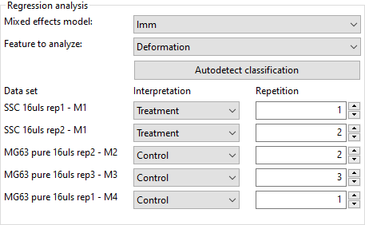
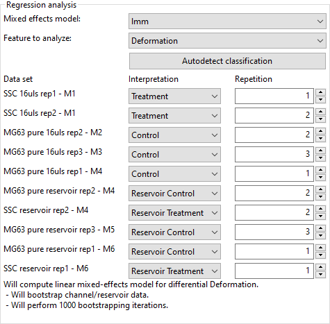

.. _sec_qg_mixed_effects:

===========================
Comparing datasets with LMM
===========================

It is not straightforward to define a p-Value for RT-DC data (e.g. change
in deformation for a treatment vs. its control). This is somewhat
counter-intuitive, because one could assume that the large number of
events in a single dataset should be enough to compare two datasets.
Focus changes, chip-to-chip variations, etc. may generate
systematic offsets which make a direct comparison (e.g. t-Test) impossible.
Linear mixed models (LMM) allow to assign a significance to a treatment
(fixed effect) while considering the systematic bias in-between the
measurement repetitions (random effect).

Shape-Out offers a LMM analysis as described in :cite:`Herbig2018`.
The LMM analysis is performed using the
`lme4 R package <https://CRAN.R-project.org/package=lme4>`_. 
Here, we make use of the dataset :cite:`FigshareLMM` to illustrate this
functionality.

Basic linear mixed models
-------------------------
We would like to quantify the difference between human skeletal stem cells
(SSC) and the human osteosarcoma cell line MG-63 (which is often used as a
model system for SSCs) using a likelihood ratio test based on LMM.

From the dataset :cite:`FigshareLMM`, load the following files into Shape-Out:

- SSC_16uls_rep1_20150611.rtdc  (SSC repetition 1)
- SSC_16uls_rep2_20150611.rtdc  (SSC repetition 2)
- MG63_pure_16uls_rep1_20150421.rtdc  (MG-63 repetition 1)
- MG63_pure_16uls_rep2_20150422.rtdc  (MG-63 repetition 2)
- MG63_pure_16uls_rep3_20150422.rtdc  (MG-63 repetition 3)

In this example, we treat SSC as our "treatment" and MG-63 as our "control".
These are just names that remind us that we are comparing one type of sample
against another type.

In the *Filter* tab, please choose the following *Box filters*:

- Porosity (*area_ratio*): 0 to 1.05
- Area [µm²] (*area_um*): 120 to 550
- Deformation (*deform*): 0 to 0.1

Hit *Apply* and proceed to the *Calculate* tab. We would also like to
have a look at the Young's modulus. The medium (CellCarrier) and the
temperature (23°C) should already be set. Hit *Compute elastic modulus*
to make the Young's modulus available. 

Proceed to the *Analyze* tab. Set the *Interpretation* and
*Repetition* according to the following scheme (see screenshot):

- SSC: Treatment
- MG63: Control
- Repetition according to the file/sample name

Make sure that the feature "Deformation" is selected and hit *Apply*. The
results of the LMM analysis are shown in your default text editor::

    LINEAR MIXED MODEL: 
    Linear mixed model fit by REML ['lmerMod']
    Formula: xs ~ treatment + (1 + treatment | timeunit)
       Data: RTDC
    
    REML criterion at convergence: -34724.9
    
    Scaled residuals: 
        Min      1Q  Median      3Q     Max 
    -2.0760 -0.7148 -0.1546  0.5299  5.3384 
    
    Random effects:
     Groups   Name               Variance  Std.Dev.  Corr
     timeunit (Intercept)        0.000e+00 0.000e+00     
              treatmentTreatment 5.438e-23 7.374e-12  NaN
     Residual                    1.592e-04 1.262e-02     
    Number of obs: 5883, groups:  timeunit, 3
    
    Fixed effects:
                         Estimate Std. Error t value
    (Intercept)         0.0319279  0.0002052  155.58
    treatmentTreatment -0.0013548  0.0003433   -3.95
    
    Correlation of Fixed Effects:
                (Intr)
    trtmntTrtmn -0.598
    
    COEFFICIENT TABLE:
      (Intercept) treatmentTreatment
    1  0.03192788       -0.001354766
    2  0.03192788       -0.001354766
    3  0.03192788       -0.001354766
    
    
    LIKELIHOOD RATIO TEST (MODEL VS.  NULLMODEL): 
    Data: RTDC
    Models:
    NullModel: xs ~ (1 + treatment | timeunit)
    Model: xs ~ treatment + (1 + treatment | timeunit)
              Df    AIC    BIC logLik deviance  Chisq Chi Df Pr(>Chisq)  
    NullModel  5 -34738 -34705  17374   -34748                           
    Model      6 -34743 -34703  17377   -34755 6.2303      1    0.01256 *
    ---
    Signif. codes:  0 ‘***’ 0.001 ‘**’ 0.01 ‘*’ 0.05 ‘.’ 0.1 ‘ ’ 1

The most important numbers are:

- **Fixed effects (Intercept)-Estimate:**
  The mean of the parameter chosen for all controls.
    
- **Fixed effects treatment-Estimate:**
  The effect size of the parameter chosen between the mean
  of all controls and the mean of all treatments.

- **Full coefficient table:**
  Shows the effect size of the parameter chosen between control and
  treatment for every single experiment.

- **Model-Pr(>Chisq):**
  Shows the p-value and the significance of the test.

We are interested in the p-value, which is 0.01256 for
Deformation. We repeat the analysis with Area (0.0002183) and Young's
modulus (0.0002771). The p-values indicate that MG-63 (mean elastic
modulus 1.26 kPa) cells are softer than SSCs (mean elastic modulus 1.54 kPa)
:cite:`Herbig2018`.

.. important::

  **Why are the p-values different when I swap repetitions in LMM analysis?**

  *(A comment by Maik Herbig)*

  If this happens, you essentially changed the pairing of measurements. 
  In Shape-Out you can determine the "Repetition number" of your experiment.
  If the same repetition number is chosen for a "Control" and a "Treatment"
  measurement, a paired test will be conducted. In your experimental design
  you determine which measurements are paired, before doing any experiments.
  Do not start to pair experiments after you have seen the data to obtain the
  lowest p-value (this would be p-hacking). For example you could decide to
  measure one "control" and one "treated" sample on three consecutive days.
  Then, it makes sense to pair the measurements of the same day. Oftentimes
  this is not possible and you have to measure 3x "control" on one day and
  3x "treated" on the next day. Then you could for example pair the first
  measurement of "control" with the first measurement of "treated" and the
  second of "control" with the second of "treated" and so on.

  Alternatively, you can also run an an unpaired test by just giving each
  measurement a different "Repetition" number. For example when having 3x
  "control" and 3x "treatment" you could give it numbers from 1 to 6.

LMM analysis of differential deformation
----------------------------------------
The LMM analysis is only applicable if the feature chosen is not pronounced
visibly in the reservoir measurements.
For instance, if a treatment results in non-spherical cells in the reservoir,
then the deformation recorded for the treatment might be biased towards
higher values. In this case, the information of the reservoir measurement
has to be included by means of differential deformation :cite:`Herbig2018`.
The idea of differential deformation is to subtract the reservoir from the
channel deformation. Since it is not possible to assign the events in the
reservoir to the events in the channel (two different measurements),
bootstrapping is employed which generates statistical representations
of the two measurements that can then be subtracted from one
another. Then, for the actual LMM analysis, only the differential
deformation is used.

For differential deformation analysis, we need for each repetition a reservoir
measurement (e.g. Treatment 1 and Reservoir Treatment 1).
From the dataset :cite:`FigshareLMM`, load the following files into Shape-Out
and proceed with filtering as described above:

- SSC_16uls_rep1_20150611.rtdc  (SSC repetition 1)
- SSC_16uls_rep2_20150611.rtdc  (SSC repetition 2)
- SSC_reservoir_rep1_20150611.rtdc  (SSC reservoir repetition 1)
- SSC_reservoir_rep2_20150611.rtdc  (SSC reservoir repetition 2)
- MG63_pure_16uls_rep1_20150421.rtdc  (MG-63 repetition 1)
- MG63_pure_16uls_rep2_20150422.rtdc  (MG-63 repetition 2)
- MG63_pure_16uls_rep3_20150422.rtdc  (MG-63 repetition 3)
- MG63_pure_reservoir_rep1_20150421.rtdc  (MG-63 reservoir repetition 1)
- MG63_pure_reservoir_rep2_20150422.rtdc  (MG-63 reservoir repetition 2)
- MG63_pure_reservoir_rep3_20150422.rtdc  (MG-63 reservoir repetition 3)

In the *Analyze* tab, there are now ten measurements to assign. Proceed as
above, using the sample names as indicator for treatment/control and
repetition (see screenshot).

.. note:: The data sets are ordered according to run index. In an ideal case,
    the run index would resemble the repetition of an experiment. Here,
    however, the run index is only an internal lab book reference.

The results read as follows::
    
    LINEAR MIXED MODEL ON BOOTSTAP-DISTRIBUTIONS: 
    Linear mixed model fit by REML ['lmerMod']
    Formula: xs ~ treatment + (1 + treatment | timeunit)
       Data: RTDC
    
    REML criterion at convergence: -59591.1
    
    Scaled residuals: 
        Min      1Q  Median      3Q     Max 
    -6.5206 -0.5391  0.0077  0.5700  6.3890 
    
    Random effects:
     Groups   Name               Variance  Std.Dev.  Corr 
     timeunit (Intercept)        2.939e-07 0.0005421      
              treatmentTreatment 1.273e-06 0.0011284 -1.00
     Residual                    3.862e-07 0.0006215      
    Number of obs: 5000, groups:  timeunit, 3
    
    Fixed effects:
                         Estimate Std. Error t value
    (Intercept)         0.0205095  0.0003132   65.49
    treatmentTreatment -0.0052991  0.0006518   -8.13
    
    Correlation of Fixed Effects:
                (Intr)
    trtmntTrtmn -1.000
    
    COEFFICIENT TABLE:
      (Intercept) treatmentTreatment
    1  0.01993562       -0.004104567
    2  0.02058056       -0.005447047
    3  0.02101226       -0.006345642
    
    
    LIKELIHOOD RATIO TEST (MODEL VS.  NULLMODEL): 
    Data: RTDC
    Models:
    NullModel: xs ~ (1 + treatment | timeunit)
    Model: xs ~ treatment + (1 + treatment | timeunit)
              Df    AIC    BIC logLik deviance  Chisq Chi Df Pr(>Chisq)   
    NullModel  5 -59605 -59572  29807   -59615                            
    Model      6 -59613 -59574  29813   -59625 10.584      1   0.001141 **
    ---
    Signif. codes:  0 ‘***’ 0.001 ‘**’ 0.01 ‘*’ 0.05 ‘.’ 0.1 ‘ ’ 1

The p-value for the differential deformation is 0.001141 which is a magnitude
lower than the p-value for the (non-differential) deformation above. This
indicates that there is a non-negligible initial deformation of the cells
in the reservoir.

.. attention:: 
    Differential LMM analysis does not make sense for all features. For
    instance, differential area will yield high values, because the measured
    area in the reservoir and the sample are similar. Thus, the LMM analysis
    is performed with distributions that are all centered around zero,
    yielding no significant difference.

    
Generalized linear mixed models (GLMM)
--------------------------------------
Shape-Out also makes available one GLLM.
The implementation uses the function ``glmer`` (instead of ``lmer`` for LMM)
from the lme4 R package. It employs an additional log-link function using
the *family* keyword argument (``family=Gamma(link='log')``). The Gamma
function is used generally for data that are continuous and non-negative.
The log-link function is useful if the feature distribution is log-normal. 
The log-link function exponentiates the linear predictors of the LMM
(It does not log-transform the outcome variable).

Log-normal behaviour
is a quite common, especially in biology. When a physical parameter has a
lower limit, and the measured values are close to that limit, the
resulting distribution will be skewed, resembling a log-normal distribution.
In case of RT-DC this is specially (but not only) true for deformation.
Another example is area, which also has a lower limit of zero and may
therefore have a skewed distribution. While GLMMs are designed to handle
skewed data, it was shown that LMMs already deliver robust results, even
for highly skewed data :cite:`gelman_hill_2006`.

.. warning::
    As we learned above, the decision whether to use LMM or GLMM is not
    particularly important. Ideally, both LMM and GLMM are consistent.
    However, never perform both analyses only to then pick the one
    with the lowest p-value. This is p-hacking! The analysis routine
    should be defined beforehand. If in doubt, stick to LMM.
