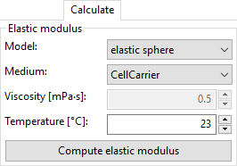
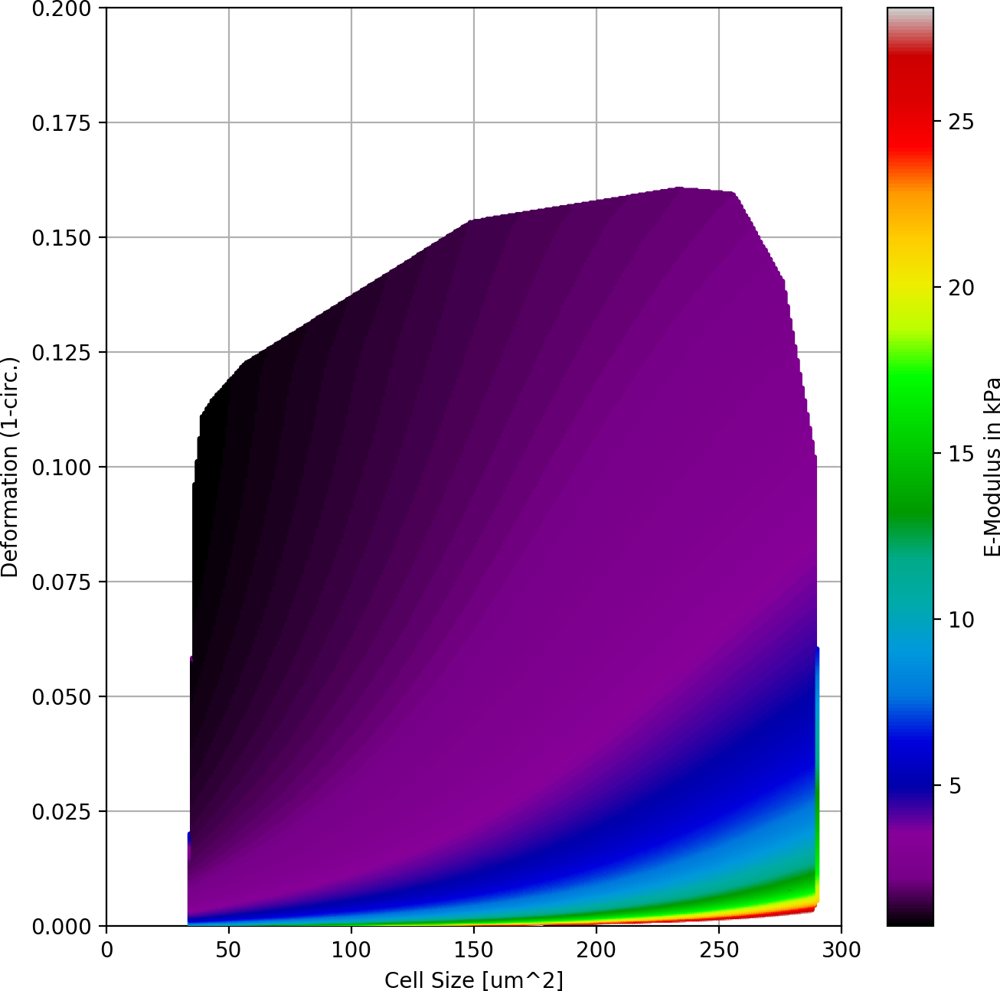

.. _sec_qg_youngs_modulus:

===============
Young's Modulus
===============
With Shape-Out it is possible to convert deformation values to values
of the Young's modulus based on numerical simulation for
fully elastic spheres according to Mokbel et al. :cite:`Mokbel2017`.

The "Calculate" tab  allows you to obtain
the Young's modulus for the samples in the current analysis.
After choosing the type of measurement medium you must set the
right temperature or – in case you choose "Other" – the correct
viscosity. For CellCarrier media, the correct viscosity is
automatically calculated according to the shear thinning
behavior as analyzed in :cite:`Herold2017`.

Once "Compute elastic modulus" is clicked, the Young's modulus will become
available for plotting and data analysis.

**Validity**:

The computation of the Young's modulus is valid only for objects that
initially have a spherical shape. In addition, the deformation and
size values must be in a "valid region". Events outside this region will
have a *nan*-valued (not a number) Young's modulus. Note that as a result,
these events will be excluded from all plots when *remove invalid events*
is checked in the *Filter* configuration tab.

    Visualization of the support and the values of the look-up table (LUT)
    used for determining the Young's modulus from deformation and
    cell area. The LUT was computed from simulations according to
    :cite:`Mokbel2017` for a 20 µm wide channel, a flow rate of
    0.04 ul/s and a viscosity of 15 mPa s.

The invalid regions (white in the figure above) include objects that
are very small or objects with very low deformation values.
The reason for that is a very steep increase of the Young's modulus with
little decrease in deformation that could potentially result in very large
errors. In addition, regions with high deformation are invalid as well,
because the simulations did not converge (objects simulated with
lower Young's moduli  became more and more elongated until they ruptured).

In practice, this means that the channel size has to be selected carefully
to match the object sizes. Larger object sizes require wider channels
if meaningful values for the Young's modulus are to be computed.

In order to make this process more comfortable, in the following,
the valid regions are shown for the four standard channel sizes
available. Those representations include an offset shift in deformation
that would be expected in the experimental results due to the
pixelation of the image as described in :cite:`Herold2017`.

The values of the Young's moduli in those regions will depend
on the specific flow rate and the viscosity of the medium :cite:`Mietke2015`.
Note that in the illustrations that follow they merely represent a
relative scaling and are not to be compared between illustrations.

.. figure:: figures/youngs_modulus_validity_matrix.png
    :alt: FIGURE MISSING

    Comparison of validity ranges for computing the Young's modulus
    for commonly used channel sizes and flow rates.
